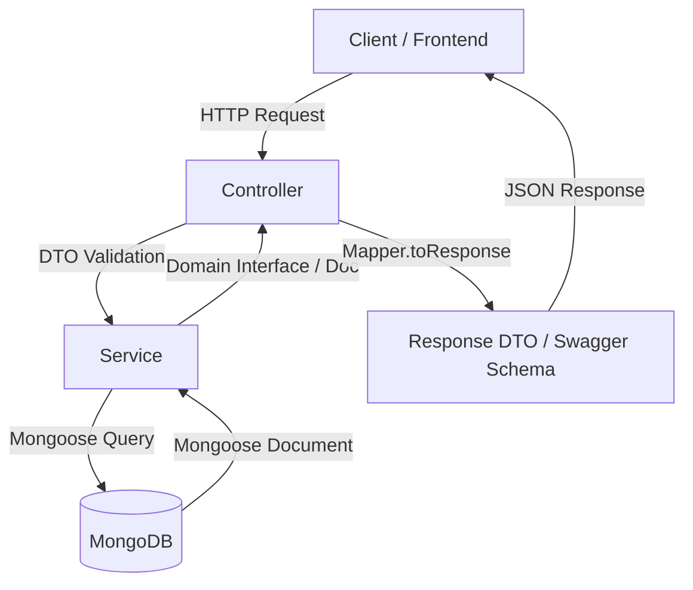
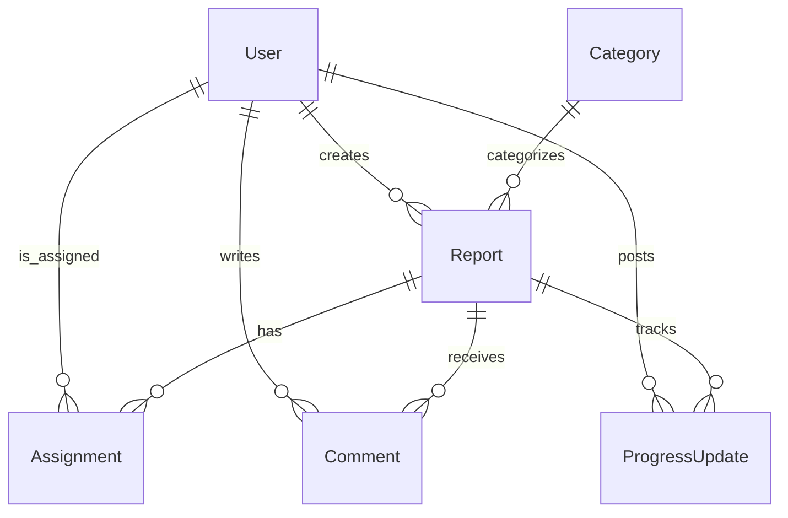

# FixMyArea (CivicConnect) Backend

FixMyArea is a robust civic problem-reporting backend API built on **NestJS** and **Mongoose (MongoDB)**. It provides a structured workflow connecting Citizens, Local Authorities, and Field Workers to report, assign, track, and resolve local public issues (potholes, street light failures, water leaks, etc.).

---

## 🏗️ Project Architecture & Design Pattern

The application is built using a highly structured, scalable **Modular NestJS Architecture**. Each domain entity has its own dedicated module, isolating its controllers, services, database schemas, mappers, and data transfer objects (DTOs).



### 📂 Directory Structure

```text
src/
├── common/                  # Shared utilities, constants, filters, interceptors
│   ├── constants/           # Core constants (e.g., MESSAGES, role schemas)
│   ├── guards/              # Authentication guards (JWT, Roles)
│   └── responses/           # API response helpers
├── database/                # Database configuration
│   ├── schemas/             # Mongoose schemas (snake_case database models)
│   ├── seeders/             # Database seeders (Roles, Categories)
│   ├── database.module.ts
│   ├── database.service.ts
│   └── schema-loader.ts     # Dynamically registers Mongoose schemas
├── modules/                 # Modular Domain Entities
│   ├── auth/                # JWT Auth, Register, Login, Refresh, Password Reset
│   ├── user/                # User accounts & Role management
│   ├── report/              # Issue reporting (Citizens create, Admins view/update)
│   ├── comment/             # Threaded issue comments & conversations
│   ├── assignment/          # Worker assignment workflows (Assigned, Accepted, Completed)
│   └── progress-update/     # Multi-step progress tracking with image attachments
└── main.ts                  # NestJS bootstrap entry point
```

---

## ⚙️ Core Architecture Concepts

### 1. Dynamic Mongoose Schema Loader (`schema-loader.ts`)
Instead of manually registering every schema in the database module, a custom `schema-loader.ts` dynamically parses files inside `src/database/schemas/`.
*   **Case Normalization**: It automatically extracts the file base name (e.g., `progress-update.schema.ts` or `user-role.schema.ts`), converts kebab-case/snake_case names into PascalCase (`ProgressUpdate`, `UserRole`), and registers them dynamically as Mongoose models.

### 2. Controller-Service-Mapper Pattern
*   **Controller**: Exposes REST endpoints, performs request payload validation using class-validator DTOs, and handles HTTP response envelopes.
*   **Service**: Contains business rules, database transactions, state-tracking logic, and coordinates database operations.
*   **Mapper**: Sanitizes database models before sending them back. It defines:
    *   `toDomain`: Converts MongoDB documents into domain interfaces.
    *   `toResponse`: Map domain data structures to clean Response DTO objects, purging internal system fields and converting database ObjectIds to string formats.

---

## 🗄️ Database Relations Map

The database follows a **snake_case** naming convention for collections and fields, utilizing MongoDB References (`ref`) for relational mapping.



*   **`User`**: Linked to specific Roles. Can be a Citizen, Admin, or Worker.
*   **`Report`**: Has a direct link to `user_id` (Citizen creator) and `category_id`.
*   **`Assignment`**: Connects a `report_id` to a `worker_id` (User) and tracks who assigned it (`assigned_by` Admin User ID).
*   **`Comment`**: Connects `report_id` to the author `user_id`. Supports threading via optional `parent_comment_id`.
*   **`ProgressUpdate`**: Posted by the assigned `worker_id` for a specific `report_id`. Optionally verified by an Admin via `verified_by`.

---

## 📝 Swagger Documentation & Dummy Data DTOs

The API is fully documented with **Swagger**. To provide front-end developers with precise interface details, we utilize custom **Response DTOs** annotated with realistic example values (dummy data):

### Swagger Example Response Schemas
- **Comment Endpoint**: Returns `CommentResponseDto` containing exact comment fields:
  ```json
  {
    "id": "60d0fe4f5311236168a109ca",
    "report_id": "60d0fe4f5311236168a109cb",
    "user_id": "60d0fe4f5311236168a109cc",
    "message": "This is a comment about the pothole.",
    "is_edited": false,
    "is_deleted": false
  }
  ```
- **Assignment Endpoint**: Returns `AssignmentResponseDto` mapping statuses and instructions:
  ```json
  {
    "id": "60d0fe4f5311236168a109da",
    "status": "assigned",
    "note": "Please inspect the pothole and fix it.",
    "is_active": true
  }
  ```
- **ProgressUpdate Endpoint**: Returns `ProgressUpdateResponseDto` representing progress tracking with array of completion images:
  ```json
  {
    "id": "60d0fe4f5311236168a109ea",
    "progress_percentage": 75,
    "images": [
      {
        "url": "https://example.com/image.jpg",
        "public_id": "cloudinary_public_id_123"
      }
    ],
    "is_final_update": false
  }
  ```

---

## 🚀 Getting Started

### 1. Setup & Installation
```bash
# Install dependencies
npm install
```

### 2. Environment Configuration
Create a `.env.development` file in the server root matching the schema:
```env
PORT=3000
MONGODB_URI=mongodb://localhost:27017/fixmyarea
JWT_SECRET=yourSuperSecretJWTKey
JWT_EXPIRES_IN=1d
```

### 3. Running Locally
```bash
# Start server in watch mode
npm run start:dev
```
Once booted, the Swagger UI is available at:
👉 **`http://localhost:3000/api/docs`**

---

## 🧪 Testing Suite

We maintain a full suite of Unit and E2E integration tests:

```bash
# Run all unit tests
npm run test

# Run e2e tests
npm run test:e2e
```
