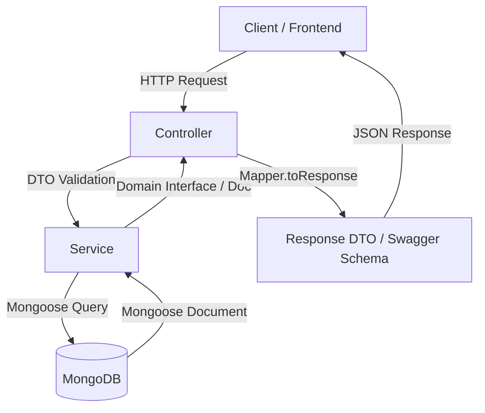
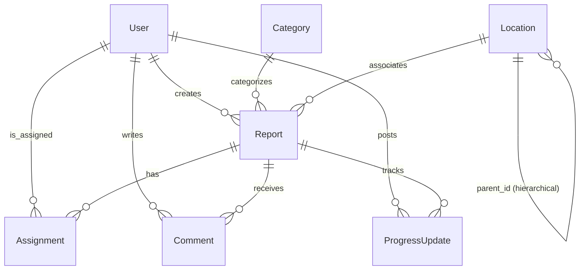

# FixMyArea (CivicConnect) Backend

FixMyArea is a robust, modular civic problem-reporting backend API built on **NestJS** and **Mongoose (MongoDB)**. It provides a structured workflow connecting Citizens, Local Authorities, and Field Workers to report, assign, track, and resolve local public issues (potholes, street light failures, water leaks, etc.).

---

## 🏗️ Project Architecture & Design Pattern

The application is built using a highly structured, scalable **Modular NestJS Architecture**. Each domain entity has its own dedicated module, isolating its controllers, services, database schemas, mappers, and data transfer objects (DTOs).



### 📂 Directory Structure

```text
src/
├── common/                  # Shared utilities, constants, filters, interceptors, guards
│   ├── constants/           # Core constants (e.g., MESSAGES, role schemas)
│   ├── decorators/          # Custom decorators (e.g., @Roles)
│   ├── dtos/                # Common Data Transfer Objects
│   ├── enums/               # Shared Enums (e.g., roles)
│   ├── filters/             # Exception filters (e.g., MongoExceptionFilter)
│   ├── guards/              # Authentication guards (JWT, Roles)
│   ├── interceptors/        # Request/Response interceptors (e.g., ResponseInterceptor)
│   ├── interfaces/          # Common TS interfaces
│   ├── middlewares/         # Logger and global middlewares
│   ├── responses/           # API response helpers
│   ├── templates/           # Email HTML templates
│   └── utils/               # Shared helper functions
├── config/                  # App configuration modules
│   ├── app.config.ts        # App port and env configuration
│   ├── database.config.ts   # Database connection string configuration
│   ├── jwt.config.ts        # JWT and Refresh tokens configuration
│   ├── mailer.config.ts     # SMTP mailer configuration
│   ├── redis.config.ts      # Redis client configuration
│   └── index.ts             # Exports loaded configurations
├── database/                # Database modules and connections
│   ├── schemas/             # Mongoose schemas (snake_case collections and fields)
│   ├── seeders/             # Database seeders (Roles, Categories)
│   ├── database.module.ts
│   ├── database.service.ts  # Database connection listeners and error helpers
│   └── utils/
│       └── schema-loader.ts # Dynamically registers Mongoose schemas
├── infrastructure/          # Core infrastructure services
│   ├── nodemailer/          # SMTP mailer service
│   └── redis/               # Redis caching service (implementation pending)
├── modules/                 # Modular Domain Entities
│   ├── auth/                # JWT Auth, Register, Login, Refresh, Password Reset, OTP
│   ├── user/                # User accounts & Profile management
│   ├── role/                # Role management & permissions (seeded automatically)
│   ├── category/            # Issue categories (seeded automatically)
│   ├── location/            # Administrative locations & hierarchy (geospatial index)
│   ├── report/              # Issue reporting (Citizens create, Admins view/update)
│   ├── comment/             # Threaded issue comments & conversations
│   ├── assignment/          # Worker assignment workflows
│   ├── progress-update/     # Multi-step progress tracking with image attachments
│   └── media/               # File upload & storage (AWS S3 / Cloudinary)
├── setup/                   # NestJS bootstrap setup files
│   ├── swagger.setup.ts     # Swagger UI documentation setup
│   └── validation.setup.ts  # Global validation pipe setup
└── main.ts                  # NestJS bootstrap entry point
```

---

## ⚙️ Core Architecture Concepts

### 1. Dynamic Mongoose Schema Loader (`schema-loader.ts`)

Instead of manually registering every schema in the database module, a custom `schema-loader.ts` dynamically parses files inside `src/database/schemas/`.

- **Case Normalization**: It automatically extracts the file base name (e.g., `progress-update.schema.ts` or `user-role.schema.ts`), converts kebab-case/snake_case names into PascalCase (`ProgressUpdate`, `UserRole`), and registers them dynamically as Mongoose models.
- **Auto-Registration**: To define a new collection, simply add a `<name>.schema.ts` in `src/database/schemas/`. It will automatically be registered under the key `PascalCaseName` for `@InjectModel('PascalCaseName')`.

### 2. Controller-Service-Mapper Pattern

- **Controller**: Exposes REST endpoints, performs request payload validation using class-validator DTOs, and handles HTTP response envelopes.
- **Service**: Contains business rules, database transactions, state-tracking logic, and coordinates database operations.
- **Mapper**: Sanitizes database models before sending them back. It defines:
  - `toDomain`: Converts MongoDB documents into domain interfaces.
  - `toResponse`: Map domain data structures to clean Response DTO objects, purging internal system fields and converting database ObjectIds to string formats.

### 3. Automatic Location Resolution for Reports

When a report is created or updated, if a coordinate pair `[longitude, latitude]` is supplied in the `location.coordinates` field without an explicit `location_id`, the system performs an automatic geospatial lookup using Mongoose's `$nearSphere` query to find the closest administrative `Location` and automatically links it to the report's `location_id` field. This enables seamless, GPS-based reporting while maintaining association with formal administrative boundaries.

---

## 🗄️ Database Relations Map

The database follows a **snake_case** naming convention for collections and fields, utilizing MongoDB References (`ref`) for relational mapping.



- **`User`**: Linked to specific Roles. Can be an Admin, User (Citizen), or Worker.
- **`Location`**: Represents administrative levels (country, state, city, area) with hierarchical parent-child relationships and GeoJSON coordinates.
- **`Report`**: Has a direct link to `user_id` (Citizen creator), `category_id`, and `location_id` (identifying the administrative Location).
- **`Assignment`**: Connects a `report_id` to a `worker_id` (User) and tracks who assigned it (`assigned_by` Admin User ID).
- **`Comment`**: Connects `report_id` to the author `user_id`. Supports threading via optional `parent_comment_id`.
- **`ProgressUpdate`**: Posted by the assigned `worker_id` for a specific `report_id`. Optionally verified by an Admin via `verified_by`.

---

## 📦 Core Domain Modules Detailed

1. **`auth`**: Manages registration, JWT login, refresh token rotation, password reset, and one-time password (OTP) verification.
2. **`user`**: Exposes user management endpoints. Allows fetching and updating user profiles, banning users, and managing account statuses.
3. **`role`**: Handles system roles (e.g. `admin`, `user`, `worker`). Populated automatically on application bootstrap.
4. **`category`**: Handles issue categories (e.g. `Pothole`, `Water Leakage`, `Street Light Outage`). Populated automatically on application bootstrap.
5. **`report`**: The central module for creating, viewing, updating, and deleting public reports. Handles issue priorities and SLA calculations. Automatically resolves coordinates to administrative locations if no location ID is supplied.
6. **`comment`**: Enables communication on reports. Supports standard comments, nested/threaded replies, and edits.
7. **`assignment`**: Coordinates assigning tasks to field workers, updating assignment statuses, and active assignment tracking.
8. **`progress-update`**: Tracks repair progress (0-100%) posted by field workers, storing notes and attachments.
9. **`media`**: General-purpose upload/delete helper. Instantiates either AWS S3 or Cloudinary provider strategies depending on env configurations.
10. **`location`**: Manages administrative levels (e.g. Area, City, State, Country) via a hierarchical structure and handles geospatial queries for mapping reports to specific service areas.

---

## ⚙️ External Infrastructure & Placeholders

For easier local development, some integrations are mocked or fall back to simulation:

- **Nodemailer (`MailerService`)**:
  - If `MAIL_HOST` is defined in `.env.development`, it connects to SMTP.
  - Otherwise, it prints sent emails to the logger output in the console (`[Mail Simulation]`), allowing you to develop without configuring SMTP.
- **Media Upload (`MediaService`)**:
  - Delegates to `ACTIVE_STORAGE_PROVIDER` (AWS / CLOUDINARY).
  - Currently, these providers are mock implementations for development, returning mock image URLs and public IDs.
- **Redis (`RedisService`)**:
  - A stub implementation is provided with key-value set/get placeholders. Actual Redis integration is pending.
- **Role & Category Seeders**:
  - Run on application startup using Nest's `OnApplicationBootstrap` interface. They automatically seed default database collections, updating them if configuration changes.

---

## 🔒 Authentication & Role Authorization

- **Authentication**: Handled via `Passport` strategy (`JwtStrategy`). Requests with a valid Bearer token have the logged-in user instance attached to `req.user`.
- **Guards**:
  - `JwtAuthGuard`: Enforces active JWT bearer token check.
  - `AdminGuard`, `UserGuard`, `WorkerGuard`: Skeletons for role validation.
  - _Note for Developers:_ Currently, role guards are mocked to return `true` for simpler development. Implement actual checks based on `req.user.role` when enforcing permissions.

---

## 🚀 Getting Started

### 1. Installation

Install node packages:

```bash
npm install
```

### 2. Environment Configuration

Create a `.env.development` file in the root of the server directory:

```env
NODE_ENV=development
PORT=3003

# Database Connection (MongoDB)
DATABASE_URL=mongodb://localhost:27017/fixmyarea

# JWT Configuration
JWT_SECRET=yourSuperSecretKeyHere
JWT_EXPIRES_IN=15m
JWT_REFRESH_SECRET=yourSuperSecretRefreshTokenKeyHere
JWT_REFRESH_EXPIRES_IN=7d

# Redis Configuration (Optional / Pending Implementation)
REDIS_HOST=localhost
REDIS_PORT=6379
REDIS_PASSWORD=

# Mailer Configuration (SMTP - Fallback to logger simulation if host is empty)
MAIL_HOST=
MAIL_PORT=587
MAIL_USER=
MAIL_PASSWORD=
MAIL_FROM=noreply@fixmyarea.com

# Media Provider Configuration ('CLOUDINARY' or 'AWS' - Mocked in development)
ACTIVE_STORAGE_PROVIDER=CLOUDINARY
```

### 3. Running Locally

Start the application in development watch mode:

```bash
npm run start:dev
```

Once started, the application will automatically seed the roles and categories into the MongoDB database.

### 4. Interactive Swagger Documentation

Swagger is initialized on the port configured in `.env`.
Go to: 👉 **`http://localhost:3003/api/docs`** to see, test, and run the API endpoints directly.

---

## 🧪 Testing Suite

We maintain a full suite of Unit and E2E integration tests:

```bash
# Run all unit tests
npm run test

# Run e2e tests
npm run test:e2e
```

---

## 📝 Guidelines for Adding a New Module

When extending the backend API with a new domain entity, follow this pattern:

1. **Create the Schema**:
   - Create a new `<domain-name>.schema.ts` inside `src/database/schemas/`.
   - Export the schema using Mongoose decorator/definitions. The dynamic `schema-loader.ts` will pick it up and register it.
2. **Generate Module Files**:
   - Create a directory `src/modules/<domain-name>/`.
   - Create the following files/sub-directories:
     - `dto/`: Add input and response validation DTOs (e.g. `create-<domain-name>.dto.ts`, `<domain-name>-response.dto.ts`).
     - `interfaces/`: Add domain types and TS interfaces.
     - `mapper/`: Define `<domain-name>.mapper.ts` for domain mapping.
     - `<domain-name>.controller.ts`: Controllers exposing REST API, decorated with Swagger `@ApiTags` and response types.
     - `<domain-name>.service.ts`: Handle database queries, validations, and logic.
     - `<domain-name>.module.ts`: Export/import dependencies, schema injection.
3. **Register the Module**:
   - Import the new module in `src/app.module.ts` imports array.
